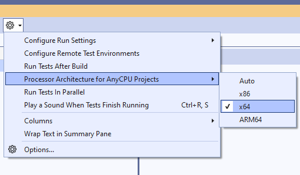

# Building and Testing

## Command Line

### Prerequisites

- [.NET 8 SDK](https://dotnet.microsoft.com/en-us/download/dotnet/8.0)

### Building

> **NOTE:** If the project is open in Visual Studio, its background restore may interfere with these commands. It is recommended to close all instances of Visual Studio that have this project open before executing.

To build the source, clone or download and unzip the repository. From the repository or distribution root, execute the [**dotnet build**](https://learn.microsoft.com/en-us/dotnet/core/tools/dotnet-build) command from a command prompt and include the desired options.

#### Example
```console
dotnet build -c Release
```

> [!NOTE]
> NuGet packages are output by the build to the `/_artifacts/NuGetPackages/` directory.

You can setup Visual Studio to read the NuGet packages like any NuGet feed by following these steps:

1. In Visual Studio, right-click the solution in Solution Explorer, and choose "Manage NuGet Packages for Solution"
2. Click the gear icon next to the Package sources drop-down.
3. Click the `+` icon (for add)
4. Give the source a name such as `Lucene.Net.CodeAnalysis.Dev Local Packages`
5. Click the `...` button next to the Source field, and choose the `/_artifacts/NuGetPackages` folder on your local system.
6. Click OK

Then all you need to do is choose the `Lucene.Net.CodeAnalysis.Dev Local Packages` feed from the dropdown (in the NuGet Package Manager) and you can search for, install, and update the NuGet packages just as you can with any Internet-based feed.

### Testing

Similarly to the build command, run [**dotnet test**](https://learn.microsoft.com/en-us/dotnet/core/tools/dotnet-build) with the desired options.

#### Example
```console
dotnet test -c Release --logger:"console;verbosity=normal"
```

## Visual Studio

### Prerequisites

1. Visual Studio 2022 or higher
2. [.NET 8.0 SDK](https://dotnet.microsoft.com/download/visual-studio-sdks) or higher

### Execution

1. Open `Lucene.Net.CodeAnalysis.Dev.sln` in Visual Studio.
2. Build a project or the entire solution, and wait for Visual Studio to discover the tests.
3. Run or debug the tests in Test Explorer, optionally using the desired filters.

> [!TIP]
> When running tests in Visual Studio, [set the default processor architecture to x86, x64, or ARM64](https://stackoverflow.com/a/45946727) as applicable to your operating system.
>
> 
